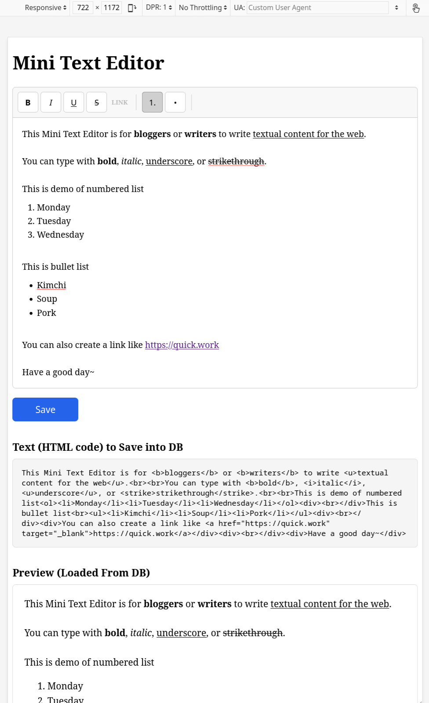

# Mini Text Editor

Write textual content for news, stories, articles, etc.

A web app component to allow writers to conveniently type-in long text.

# Requirements (must have)
1. Small JS+CSS code, has no dependency.
2. Basic text styling for **bold**, *italic*, underscore, and strikethrough.
3. **WYSIWYG** (What You See Is What You Get). 
4. The output should be HTML text and can easily be saved into database.
5. Do not add unnecessary, must maintain simple and clean JS code.

# NOTES 
1. To write text need to load tiny JS code
2. To display the text in public page there is no need to load the JS code because it is already HTML formatted.

